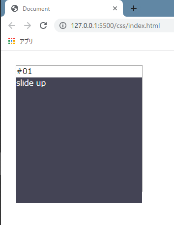
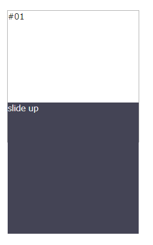
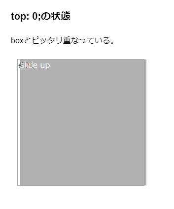
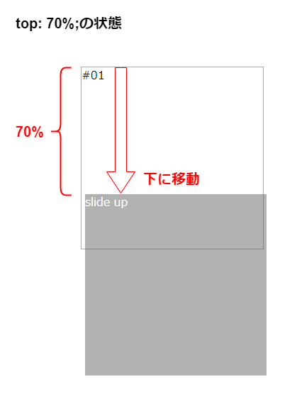

import {
  Component01,
  Component01A,
  Component01B,
  Component01C
} from "./component01"

import PageInfo from "../../components/pageInfo"
import * as Styles from "../../scss/_box.module.scss"

<Component01 />

<PageInfo
	date={props.frontmatter.date}
	update={props.frontmatter.update}
/>

<main>

<h1>{props.frontmatter.title}</h1>

こんにちは。

**CSS Animation & Tips**と題しましたこのサイト、第一回目はカーソルを合わせた時にスライドアップしてくるボックスです。仕組みが分かってしまえばすごく簡単です。

`position`プロパティの使い方に慣れるのにぴったりだと思い、第一回目の題材に持ってきました。

## boxクラスとmaskクラスを用意する

外枠として`box`クラス、浮かび上がってくる部分として`mask`クラスを`div`タグで用意します。

`mask`の中には`p`要素などを使い、適当な文字列を入れてください。

```html
<div class="box">
	<p>#01</p>

	<div class="mask">
		<p>Slide Up</pclass=>
	</div>
</div>
```

cssはまずは以下のように記述してみます。

```css
* {
  margin: 0;
  padding: 0;
  box-sizeing: border-box;
}

body {
  padding: 30px;
}

.box {
  height: 20vw;
  width: 20vw;
  border: 1px solid #aaa;
}

.mask {
  width: 100%;
  height: 100%;
  background-color: #445;
  color: #fff;
}
```

グローバルセレクター(`*`)に`padding: 0`と`margin: 0`を記述し、余計な余白・スペースをなくしてください。また、`box`がブラウザーの左上にピッタリくっつくと思うので、`body`に`padding: 30px`などとし、適当にスペースを空けてください（任意です）。

続けて、`box`に`width`と`height`を指定します（[heightはそのままでは`%`は指定できない](https://qiita.com/shouchida/items/205fed63b886681661bd#height-%E3%81%AB%E7%9B%B8%E5%AF%BE%E5%80%A4%E3%81%8C%E6%8C%87%E5%AE%9A%E3%81%95%E3%82%8C%E3%81%9F%E5%A0%B4%E5%90%88%E3%81%AE%E9%AB%98%E3%81%95%E3%81%AE%E7%AE%97%E5%87%BA)ので、`px`や`vh`、`vw`などを使用してください）。例では正方形になる様に、`width`にも`height`にも`vw`を指定しています。

また、`mask`は`box`と同じ大きさになるように、`width`と`height`を`100%`に設定します。

CSSを適用させると以下のように表示されるはずです。



## maskクラスの位置を決定する

次に`box`を基準とし、`mask`の位置を決定します。使用するCSSプロパティは**position**です。

基準となる`box`（=親要素）に`position: relative;`、`mask`（子要素）に`position: absolute;`を指定します。

そして、親要素を基準として、どれくらい子要素をずらすかを、`top`、`bottom`、`left`、`right`プロパティで指定します。`top: 70%`を指定してみましょう。

```css
/* (略) */

.box {
	position: relative;
	height: 20vw;
	width: 20vw;
	border: 1px solid #aaa;
}

.mask {
	position: absolute;
	top: 70%;
	width: 100%;
	height: 100%;
	background-color: #445;
	color: #fff;
}
```

以下の画像のような状態に変化しましたか？



何が起こったかを説明します。`top: 70%`によって、親要素である`box`の上から70%分、`mask`が下にずれます。この70%は`box`の高さの70%です（`mask`自身の高さの70%ではありません）。`box`は20vwを指定しているので、14vw下にずれることになりますね。





そしてこれを、「hoverした時に`top: 0`にする」CSSを書いていきます。

## hover擬似クラスを指定する

今回は`mask`にカーソルを乗せた時の動作を記述するので、以下のようにhover擬似要素を指定します。

```css
/* (略) */

.mask {
  position: absolute;
  top: 70%;
  width: 100%;
  height: 100%;
  background-color: #445;
  color: #fff;
}

.mask:hover {
  top: 0;
}
```

これで`mask`にカーソルを乗せた時、`top: 0`の位置まで移動するようにできました。

<Component01A />

続けて、`box`からはみ出している部分を隠すために、`overflow-y: hidden`を適用します。

```css
/* (略) */

.box {
  position: relative;
  height: 30vw;
  width: 30vw;
  border: 1px solid #aaa;
  overflow-y: hidden;
}

/* (略) */
```

<Component01B />

これでホバーした時に`mask`をスライドアップさせるという基本機能は実装できましたね。あとはアニメーションを付けて、滑らかにスライドさせるようにすれば完成です。

## CSSトランジションでアニメーションを適用する

CSSトランジションとは何なのでしょうか？ [MDNによると](https://developer.mozilla.org/ja/docs/Web/CSS/CSS_Transitions/Using_CSS_transitions) 、

>「CSS トランジションは、 CSS プロパティが変化する際の<mark>アニメーションの速度を操作する</mark>手段を提供します。プロパティの変更を直ちに有効にするのではなく、プロパティの変更を一定期間にわたって発生させることを可能にします。」

とのことです。もうちょっとかみ砕いて言うと、状態の変化をアニメーションとして表現することができる機能であるということです。今回で言う「状態の変化」とは、`top: 70%`から`top: 0`への変化です。

CSSトランジションは、その名の通り**transitionプロパティ**を使用して適用します。

### `transition-duration`

`transition-duration`プロパティで、状態の変化にかかる時間を指定することができます。

`mask`に記述します。hover擬似要素ではありません。変化に0.5秒かけるとすると、以下のように記述します。

```css
/* (略) */

.mask {
  position: absolute;
  top: 70%;
  width: 100%;
  height: 100%;
  background-color: #445;
  color: #fff;
  transition-duration: 0.5s;
}

.mask:hover {
  top: 0;
}
```

<Component01C />

## positionプロパティって何なの?

ここからは、アニメーションというより`position`の話です。`position`はそのボックスの配置方法を決めるプロパティで、相対位置(`relative`)か絶対位置(`absolute` もしくは `fixed`)かを指定できます。

まずは絶対配置から説明します。子要素である`mask`に`abosolute`を指定しましたが、これで`mask`は絶対位置を基準として配置場所が決定されることになります。これはどういうことかというと、「ある基準点（絶対位置）を定めて、配置位置を決めますよ」という意味です。

「じゃあその基準点はどこになるの？」という所ですが、absoluteが指定されている場合、親要素をたどっていき、`static`**以外**（relative、absolute、fixed）が指定されている要素を基準点とします。もしどこにも記述がなければ、ブラウザー（html要素）が基準点になります。

今回は親要素である`box`に`relative`を指定しているので、`box`が基準になります。つまり下図で言うと、赤枠で囲っている部分からどれだけずらして配置する？を指定することになります。


### じゃあ相対位置って?

さくっと説明しましたが、「なんだよ、じゃあ相対位置ってなんだよ。全部relativeを指定したらどうなるんだよ」などの疑問が沸くかもしれません。

ではmaskクラスにrelativeを指定してみましょう。相対位置・・・という言葉はわかりにくいので、「positionを指定していない時に配置される位置を基準にする」という言い方に変えてみるとどうでしょう。

positionを指定しない場合(つまり、通常の状態ですね)は以下のような配置になっていましたね。この時のmaskクラスの位置が基準になります。


つまり、maskクラスに`position: relative`を指定すると以下のような配置になります。


この通り、「もともとmaskクラスがあった位置を基準」に配置することになります。

</main>
